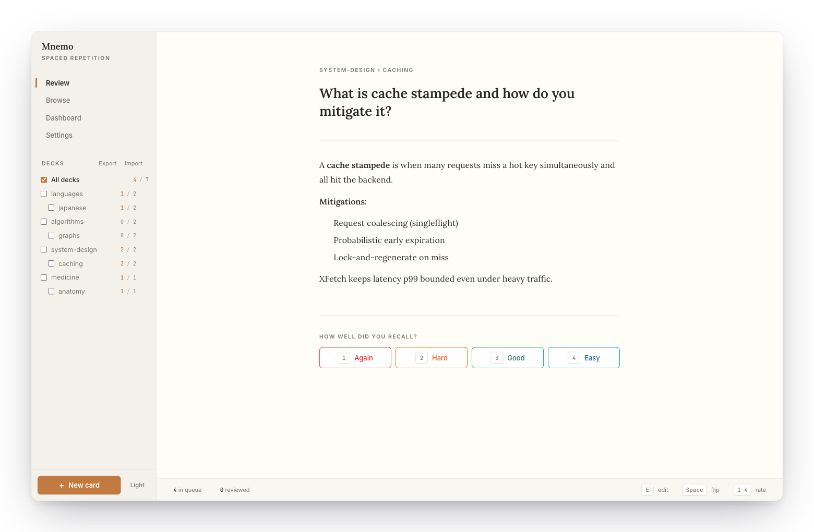
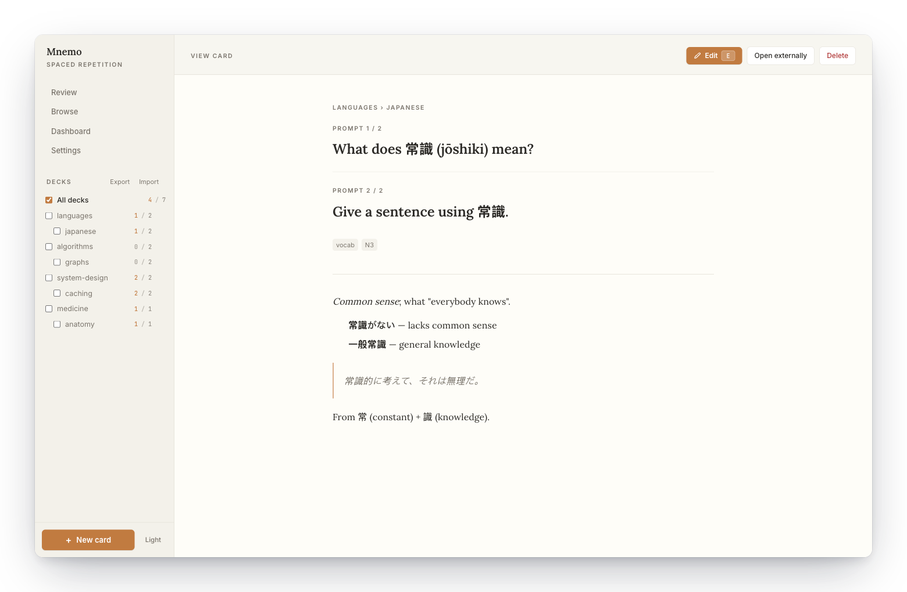
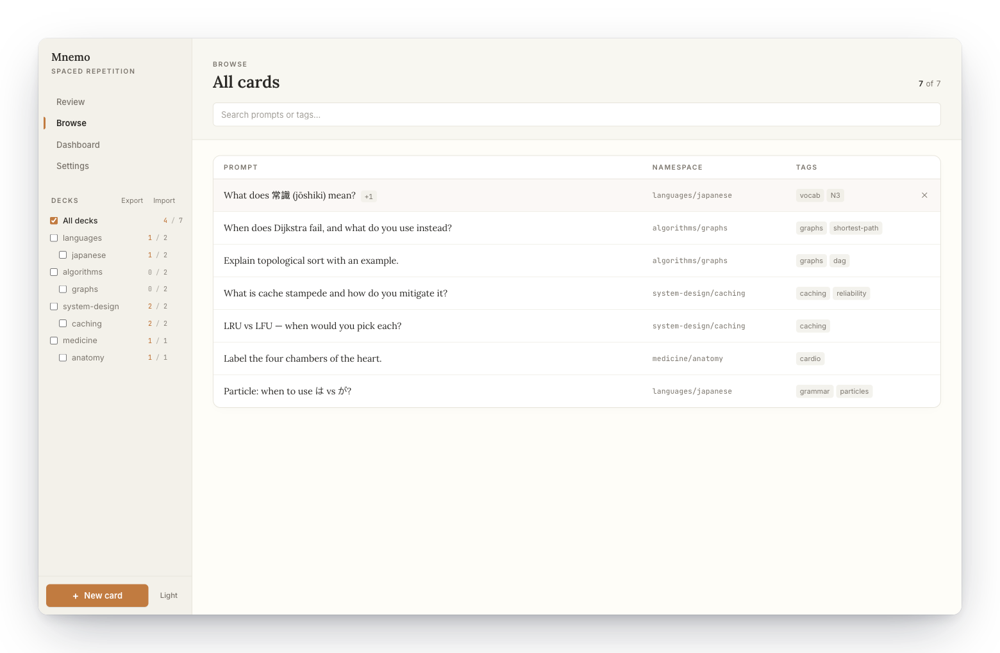
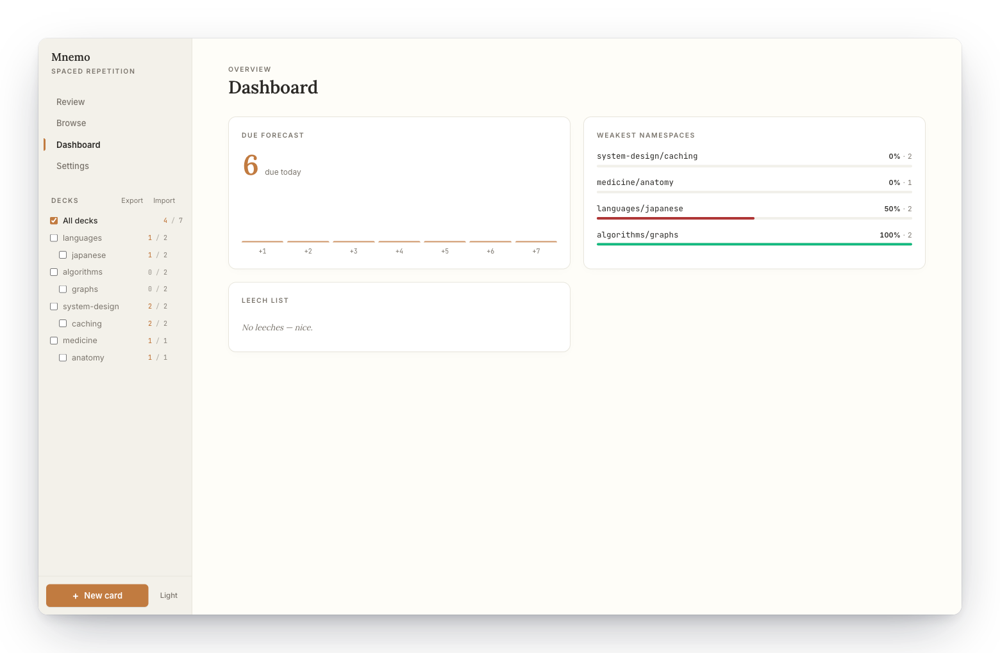
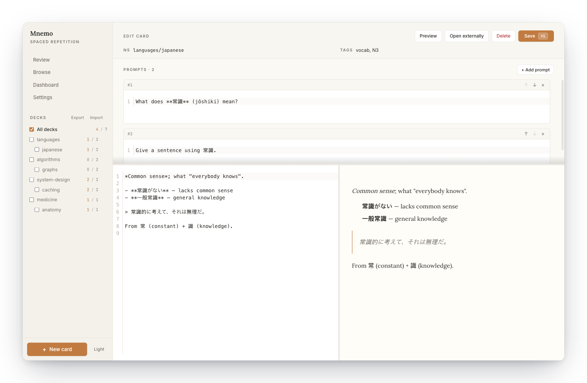
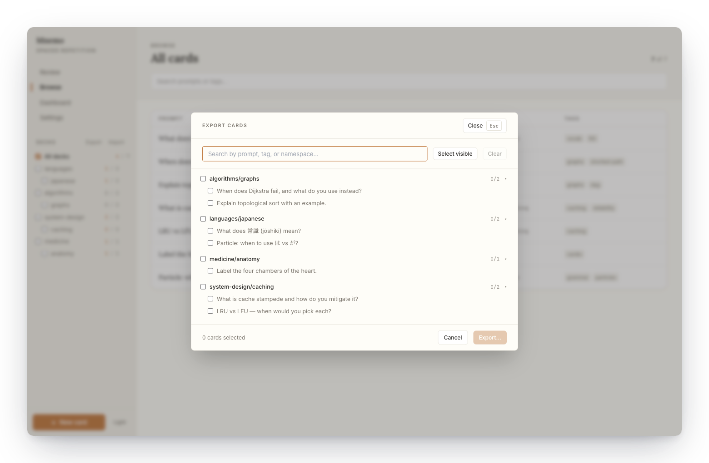

<p align="center">
  
</p>

<h1 align="center">Mnemo</h1>

<p align="center">
  A local-first spaced-repetition app for anything you want to memorise — languages, algorithms, medicine, trivia, whatever.<br/>
  Cards are plain markdown files you own: edit in any editor, track in git.<br/>
  Scheduling uses <a href="https://github.com/open-spaced-repetition/ts-fsrs">FSRS</a>.
</p>

<p align="center">
  
</p>

<p align="center">
  
</p>

<p align="center">
  
</p>

<p align="center">
  
</p>

<p align="center">
  
</p>

## Features

- Plain-markdown cards with YAML front-matter
- Folder layout defines the namespace — whole decks can be deleted from the sidebar
- FSRS scheduling with configurable retention and maximum interval
- Live file watcher — edit cards in any editor, the app updates instantly
- Full-text search across prompts and bodies
- Read-mode card viewer with an explicit Edit affordance — separates recall from authoring
- Configurable dashboard with per-widget titles and descriptions (due forecast, leech list, heatmap, streaks, namespace ranking, key stats)
- Share cards between machines via a portable `.mnemo.zip` archive (export with search + multi-select, import with preview, target namespace, and skip/overwrite)
- Dark, light, and system themes
- Cross-platform packaging for macOS, Windows, and Linux

## Getting started

```bash
npm install
npm run dev
```

On first launch, pick a root folder — it becomes your vault.

## Card format

```markdown
---
id: 01HXYZABC...
prompts:
  - id: 01HXYZPROMPT1...
    text: 'What does **常識** (jōshiki) mean?'
  - id: 01HXYZPROMPT2...
    text: 'Give a sentence using 常識.'
tags: [japanese, vocab]
created: 2026-01-15T10:23:00.000Z
---

Free-form markdown. Explanations, code, diagrams — whatever helps you remember.
```

| Field | Meaning |
|---|---|
| `id` | ULID, auto-generated. The scheduler keys review state off this. |
| `prompts` | One or more question variants. Each has its own ULID so the scheduler can keep edits stable across renames. During review, one prompt is picked at random. |
| `tags` | Free-form, used for filtering and search. |
| `created` | ISO 8601 timestamp. |

The body below the front-matter is the shared answer, shown after you reveal — same for every prompt on the card.

Review state (stability, difficulty, due date, history) lives in a separate `state/` directory next to your cards, so your markdown stays clean and diff-friendly.

## Namespaces

The folder a card lives in is its namespace.

```
vault/
  cards/
    languages/
      japanese/vocab.md         → languages/japanese
      spanish/verbs.md          → languages/spanish
    algorithms/
      graphs/dijkstra.md        → algorithms/graphs
    medicine/
      anatomy/heart.md          → medicine/anatomy
```

The sidebar tree, namespace ranking widget, and review filters all derive from this layout. Hover a deck in the sidebar to delete it — the app removes the namespace folder, every card under it, and the matching review state atomically.

## Sharing cards

Cards are portable. To hand some off to another machine or another person:

1. **Export** — open the sidebar → Export, search and multi-select cards (tri-state namespace checkboxes let you grab whole decks at once), pick a destination. You get a single `.mnemo.zip` containing every selected card plus any assets they reference.
2. **Import** on the other side — Sidebar → Import, pick the archive, preview the card count, choose a target namespace (defaults to `imported`), and decide whether to skip or overwrite cards whose IDs already exist.

<p align="center">
  
</p>

Review state (stability, difficulty, due date) is **not** shared — archives carry cards and assets only. Progress stays local to each machine.

## Scripts

| Command | Description |
|---|---|
| `npm run dev` | Vite + Electron with hot reload |
| `npm run build` | Typecheck and build |
| `npm run typecheck` | `tsc --noEmit` |
| `npm run test` | Vitest unit tests |
| `npm run e2e` | Playwright end-to-end |

See [Building for release](#building-for-release) for packaging commands.

## Building for release

Packaging is handled by [electron-builder](https://www.electron.build/). Per-platform targets are declared in `electron-builder.yml`.

| Command | Platform | Artifacts |
|---|---|---|
| `npm run dist` | Auto-detected (current OS) | — |
| `npm run dist:mac` | macOS | `.dmg`, `.zip` |
| `npm run dist:win` | Windows | NSIS installer (`.exe`) |
| `npm run dist:linux` | Linux | `AppImage`, `.deb` |

Artifacts land in `out/`. The first run downloads the Electron binaries for the target platform and may take a few minutes.

### Cross-building

Each installer format needs its target OS — either natively or emulated:

- **`.dmg`** — build on macOS only. Apple's tooling isn't available elsewhere.
- **Windows `.exe`** — build on Windows, or on macOS/Linux with [Wine](https://www.winehq.org/) installed.
- **Linux `AppImage` / `.deb`** — build on any OS.

### Code signing (optional)

Unsigned builds run fine locally, but users will see OS warnings. For distribution:

- **macOS** — export your Developer ID certificate as a `.p12`, then set `CSC_LINK` (path or base64) and `CSC_KEY_PASSWORD` before `npm run dist:mac`. For notarisation, also set `APPLE_ID`, `APPLE_APP_SPECIFIC_PASSWORD`, and `APPLE_TEAM_ID`.
- **Windows** — set `CSC_LINK` + `CSC_KEY_PASSWORD` with your code-signing certificate.

Full details: [electron-builder signing docs](https://www.electron.build/code-signing).

### App icon

The Mnemo logo lives at `assets/logo.svg`. To produce platform icons (`.icns` for macOS, `.ico` for Windows, `.png` set for Linux), rasterise the SVG to a 1024×1024 PNG and drop it at `build/icon.png` — electron-builder will generate the rest automatically on `npm run dist`.

## Project structure

```
src/
├── main/       Electron main process — disk I/O, FSRS, IPC, file watcher
├── preload/    Context-bridge API exposed to the renderer
├── renderer/   React UI (routes, widgets, stores)
└── shared/     Zod schemas and types used by both sides
```

## Data

- **Cards and review state** live under the vault folder you picked — back them up like any other notes.
- **App config** is stored in the OS-standard app-data directory:
  - macOS — `~/Library/Application Support/Mnemo/`
  - Windows — `%APPDATA%/Mnemo/`
  - Linux — `~/.config/Mnemo/`

All writes are atomic (temp file + rename), so a crash mid-write won't corrupt state.
