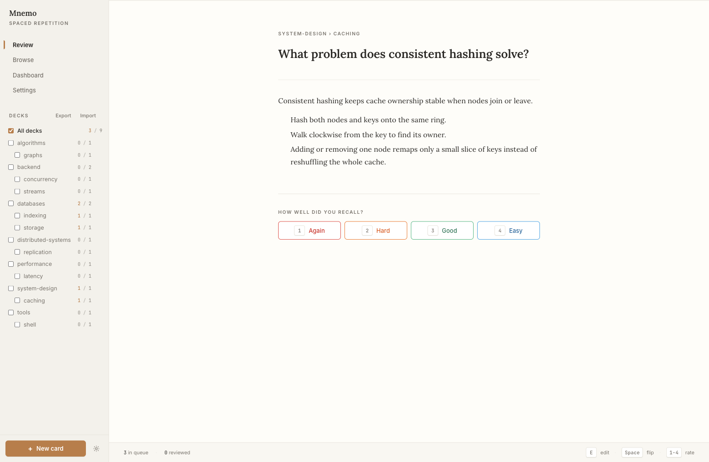
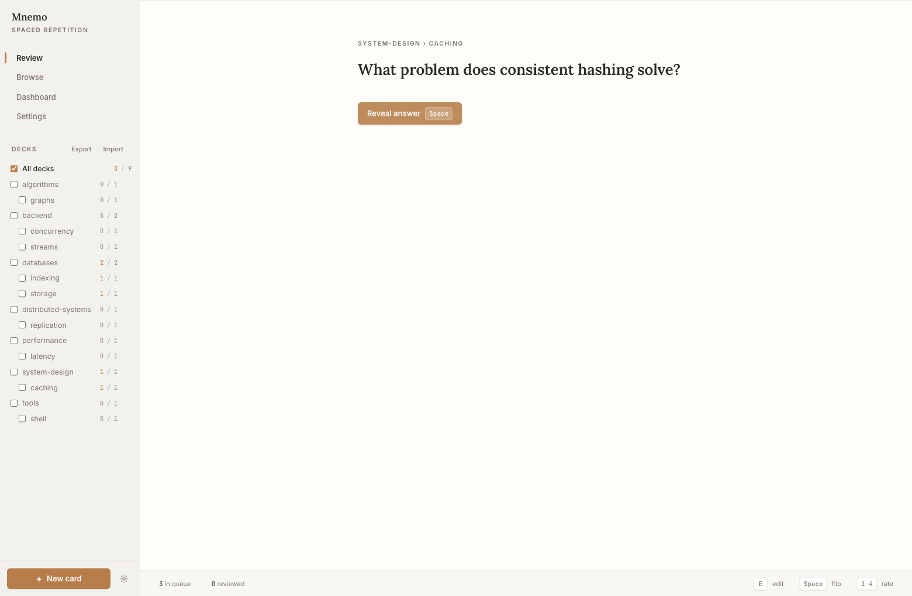
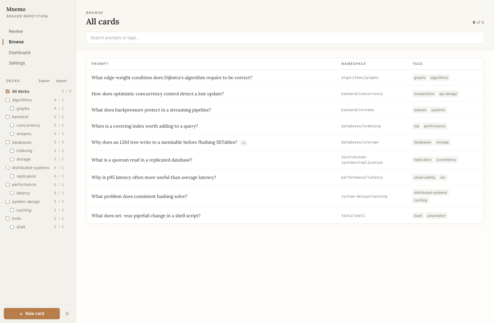
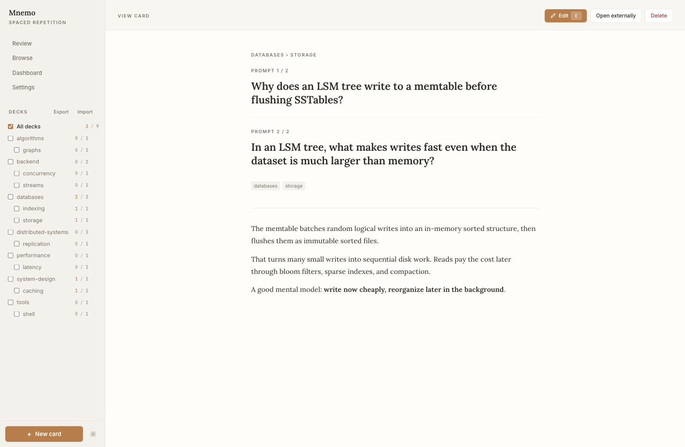
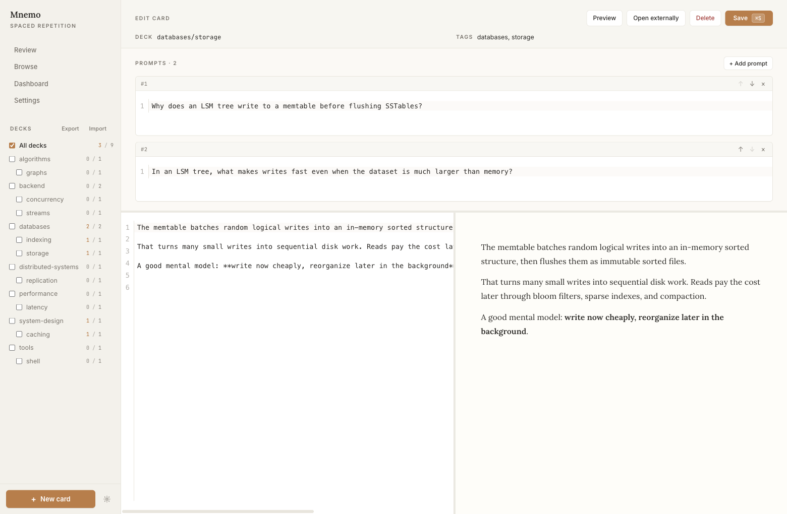
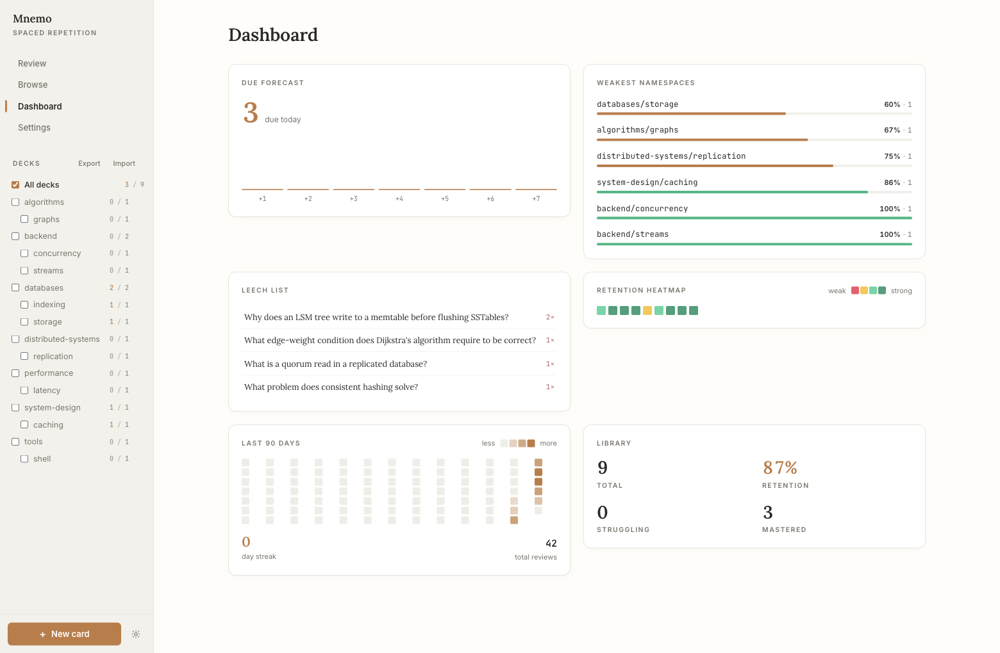
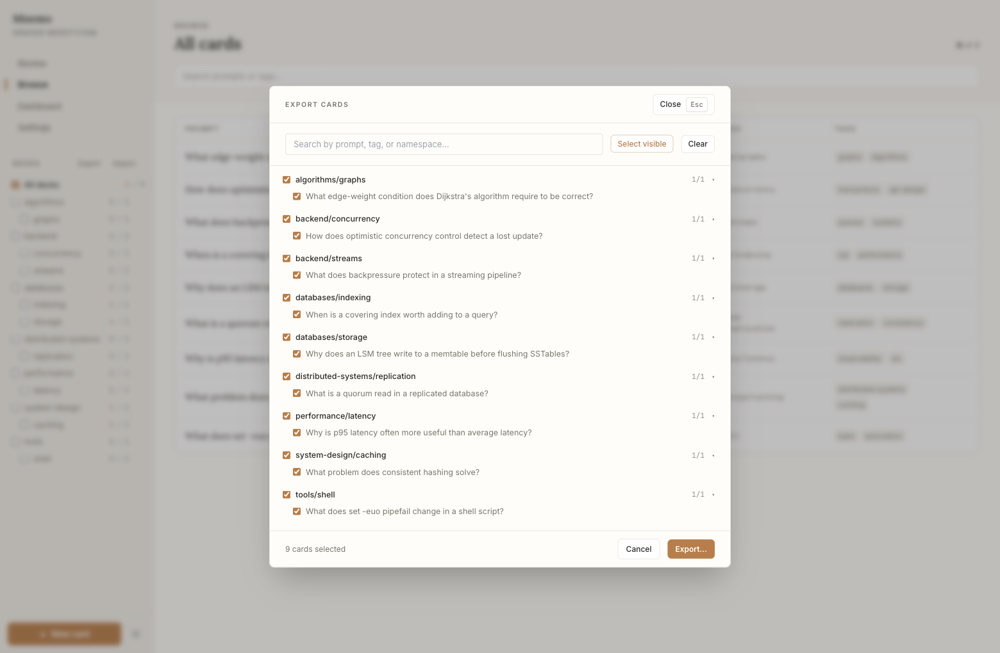

<p align="center">
  
</p>

<h1 align="center">Mnemo</h1>

<p align="center">
  <strong>Local-first spaced repetition for cards you actually own.</strong><br/>
  Write cards in Markdown, organize them with folders, review with FSRS, and sync or back them up like normal files.
</p>

<p align="center">
  <a href="https://github.com/yarikleto/mnemo/releases">
    
  </a>
  <a href="https://github.com/yarikleto/mnemo/actions/workflows/build.yml">
    
  </a>
  
  
</p>

<p align="center">
  <a href="https://github.com/yarikleto/mnemo/releases"><strong>Download Mnemo</strong></a>
  &nbsp;·&nbsp;
  <a href="#screenshots">Screenshots</a>
  &nbsp;·&nbsp;
  <a href="#card-format">Card format</a>
  &nbsp;·&nbsp;
  <a href="#development">Development</a>
</p>

<p align="center">
  
</p>

## Why Mnemo

Mnemo is built for people who want spaced repetition without surrendering their study material to a service. Your cards live in a plain folder, each card is a Markdown file, and review state is stored separately so the notes stay readable and git-friendly.

| What you get | Why it matters |
|---|---|
| Markdown cards | Use prose, lists, code blocks, links, and images without a proprietary format. |
| Folder-based decks | The filesystem is the source of truth; folders become namespaces in the app. |
| FSRS scheduling | Reviews are scheduled with the modern Free Spaced Repetition Scheduler via `ts-fsrs`. |
| Live file watcher | Edit cards in Mnemo or in your editor; changes appear in the app automatically. |
| Portable archives | Export selected cards to `.mnemo.zip` and import them on another machine. |
| Local data | No account, no hosted database, no cloud lock-in. |

## Screenshots

<table>
  <tr>
    <td width="50%">
      
      <br/>
      <sub><strong>Review</strong> - focused recall, keyboard shortcuts, deck filters, and queue progress.</sub>
    </td>
    <td width="50%">
      
      <br/>
      <sub><strong>Browse</strong> - search prompts and tags across every Markdown-backed card.</sub>
    </td>
  </tr>
  <tr>
    <td width="50%">
      
      <br/>
      <sub><strong>Read cards</strong> - inspect prompts and answers without dropping into edit mode.</sub>
    </td>
    <td width="50%">
      
      <br/>
      <sub><strong>Edit</strong> - prompt variants, tags, namespaces, Markdown editing, and live preview.</sub>
    </td>
  </tr>
  <tr>
    <td width="50%">
      
      <br/>
      <sub><strong>Dashboard</strong> - due forecast, weak decks, leeches, retention heatmap, streaks, and stats.</sub>
    </td>
    <td width="50%">
      
      <br/>
      <sub><strong>Share</strong> - select cards or whole namespaces and export a portable archive.</sub>
    </td>
  </tr>
</table>

## Install

Download the newest build for your platform from [GitHub Releases](https://github.com/yarikleto/mnemo/releases).

| Platform | What to download | Notes |
|---|---|---|
| macOS | `.dmg` | Drag Mnemo into Applications. |
| Windows | `Mnemo-Setup-X.Y.Z.exe` | Run the installer. |
| Linux | `.AppImage` or `.deb` | Use the portable AppImage or install the Debian package. |

<details>
<summary><strong>Unsigned app warnings</strong></summary>

The current builds are unsigned. Mnemo is a small single-maintainer project, so macOS Gatekeeper and Windows SmartScreen may warn on first launch.

- macOS: right-click Mnemo in Applications, choose **Open**, then confirm. macOS remembers this choice.
- Windows: choose **More info** and then **Run anyway** in the SmartScreen dialog.

</details>

<details>
<summary><strong>Linux commands</strong></summary>

For AppImage:

```bash
chmod +x Mnemo-X.Y.Z.AppImage
./Mnemo-X.Y.Z.AppImage
```

For Debian or Ubuntu:

```bash
sudo dpkg -i mnemo_X.Y.Z_amd64.deb
```

</details>

## First Run

On first launch, Mnemo creates a managed vault in the OS-standard app data folder:

| Platform | Default vault |
|---|---|
| macOS | `~/Library/Application Support/Mnemo/vault` |
| Windows | `%APPDATA%/Mnemo/vault` |
| Linux | `~/.config/Mnemo/vault` |

Inside that vault:

```text
vault/
  cards/      # your Markdown cards
  state/      # Mnemo review state
```

Back up the vault like any other notes folder. If you use Git, Syncthing, Dropbox, iCloud Drive, or another file sync tool, Mnemo does not get in your way.

## Card Format

Each card is a `.md` file with YAML front matter and a Markdown answer body.

```markdown
---
id: 01HXYZABC...
prompts:
  - id: 01HXYZPROMPT1...
    text: 'What problem does consistent hashing solve?'
  - id: 01HXYZPROMPT2...
    text: 'Why does adding one cache node not reshuffle every key?'
tags: [systems, caching]
created: 2026-01-15T10:23:00.000Z
---

Consistent hashing maps both cache nodes and keys onto the same ring.
When one node joins or leaves, only the neighboring slice of keys moves.
```

| Field | Meaning |
|---|---|
| `id` | Card ULID, generated by Mnemo. Review state is keyed by this ID. |
| `prompts` | One or more question variants. Mnemo picks one during review. |
| `tags` | Free-form labels for search, filtering, and organization. |
| `created` | ISO 8601 creation timestamp. |

The answer body below the front matter is shared by every prompt on the card. Review state lives in `state/<id>.json`, not in the Markdown file, so your notes stay clean.

## Namespaces

The folder path under `cards/` becomes the card namespace.

```text
vault/
  cards/
    languages/
      japanese/vocab.md         -> languages/japanese
      spanish/verbs.md          -> languages/spanish
    algorithms/
      graphs/dijkstra.md        -> algorithms/graphs
    systems/
      caching/consistent.md     -> systems/caching
```

Namespaces power the sidebar, deck filters, dashboard ranking, and archive export. Deleting a namespace removes the folder, every card under it, and the matching review state.

## Sharing Cards

Mnemo archives contain cards and referenced assets, not review progress. That means you can share study material without copying someone else's memory state.

1. Open **Export** from the sidebar.
2. Search, select cards, or select whole namespaces.
3. Save the `.mnemo.zip` archive.
4. On another machine, choose **Import**, preview the archive, pick a target namespace, and skip or overwrite existing card IDs.

## Updates

- macOS and Linux AppImage builds can check for updates in the background and show a restart banner when an update is ready.
- Windows and Linux `.deb` builds are updated manually from [GitHub Releases](https://github.com/yarikleto/mnemo/releases).
- Auto-update checks can be disabled in **Settings -> Updates**.

## Development

Mnemo is an Electron app with a React renderer, a strict preload boundary, and a local main-process store for disk I/O, indexing, file watching, archives, and FSRS scheduling.

```bash
npm install
npm run dev
```

| Command | Description |
|---|---|
| `npm run dev` | Vite + Electron with hot reload |
| `npm run build` | Typecheck and build renderer, main, and preload bundles |
| `npm run typecheck` | TypeScript only |
| `npm run test` | Vitest unit tests |
| `npm run e2e` | Playwright end-to-end tests |
| `npm run dist` | Build an installer for the current platform |

```text
src/
  main/       Electron main process: disk I/O, FSRS, IPC, file watcher
  preload/    Context-bridge API exposed to the renderer
  renderer/   React UI: routes, widgets, stores
  shared/     Zod schemas, constants, and API types
```

## Building Releases

Packaging is handled by [electron-builder](https://www.electron.build/). Per-platform targets are declared in `electron-builder.yml`.

| Command | Platform | Artifacts |
|---|---|---|
| `npm run dist` | Current OS | Platform default |
| `npm run dist:mac` | macOS | `.dmg`, `.zip` |
| `npm run dist:mac:arm64` | macOS Apple Silicon | arm64 `.dmg`, arm64 `.zip` |
| `npm run dist:win` | Windows | NSIS installer (`.exe`) |
| `npm run dist:linux` | Linux | `AppImage`, `.deb` |

Artifacts land in `out/`. The first packaging run downloads Electron binaries and can take a few minutes.

### CI

`.github/workflows/build.yml` runs typecheck and tests, and packages installers on pushes to `main` or manual runs.

`.github/workflows/release.yml` is manual-only. Run it with a `version` input matching `package.json`; it builds platform installers and publishes `vX.Y.Z` to GitHub Releases.

### Code Signing

Unsigned builds run locally, but operating systems warn users. To sign releases:

- macOS: set `CSC_LINK`, `CSC_KEY_PASSWORD`, `APPLE_ID`, `APPLE_APP_SPECIFIC_PASSWORD`, and `APPLE_TEAM_ID`.
- Windows: set `CSC_LINK` and `CSC_KEY_PASSWORD`.

See the [electron-builder code signing docs](https://www.electron.build/code-signing) for full details.
